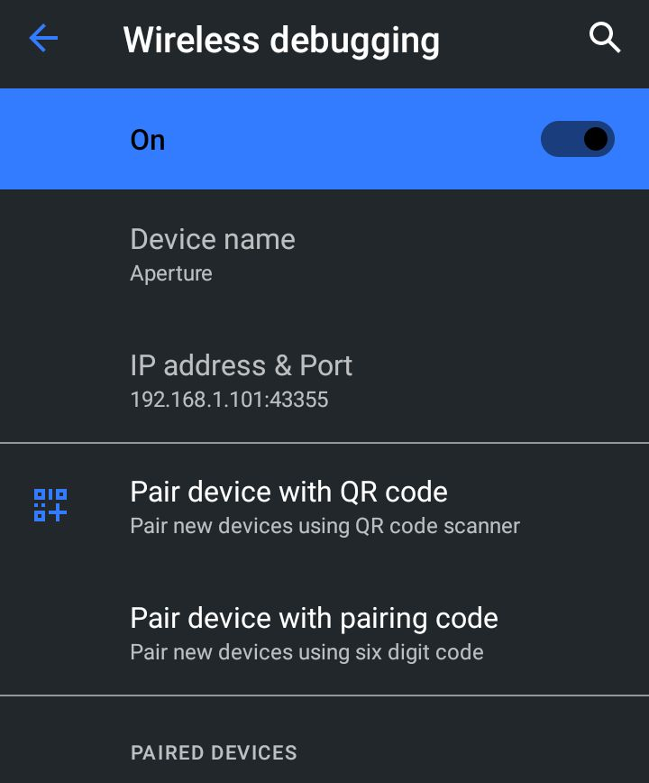
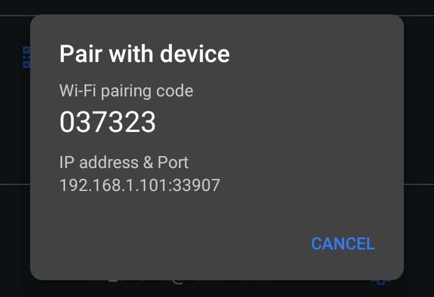

# TermuxADB
Connecting to ADB via Termux and Termux:API on Android 11+ using wireless debugging

## ENG:
First, update the termux-api packages:

```
pkg update && pkg install termux-api
```

Then install the latest version of Termux-API from F-droid. 
After installation, open the app and follow the instructions shown there.

Clone the repository:

```
git clone https://github.com/CataBars/TermuxADB
```

Navigate to it and run pair.sh:

```
cd TermuxADB && bash pair.sh
```

You should see a notification from Termux:API.


Go to Settings and navigate to "System" > "Developer options" > "Wireless debugging" (Enable it).



Tap on "Pair device with pairing code".



Enter the IP, port, and 6-digit code you received into the notification in this format: \
[IP]:[PORT] [CODE] \
If you entered everything correctly, the terminal should display: \
"Successfully pairing to [IP]:[PORT] [CODE] ..." \
Your device is now saved permanently, unless you revoke it yourself. 

Next, type:

```
adb connect [IP]:[PORT]
```

Where [IP]:[PORT] should be the one shown under "Device name".

Then type:

```
adb shell
```

And you're in Android Debug Bridge (ADB) shell.

To exit: 

```
exit
```

## RUS:
Для начала обновите пакеты termux-api
```
pkg update && pkg install termux-api
```
Затем установите последнюю версию Termux-API из F-droid \
После установки зайдите в приложение и выполните то что там написано \
Клонируйте репозиторий
```
git clone https://github.com/CataBars/TermuxADB
```
Перейдите в него и запустите pair.sh
```
cd TermuxADB && bash pair.sh
```
У вас должно появиться уведомление от Termux:API


Зайдите в настройки и передите в "Система" > "Для разработчиков" > "Отладка по Wi-FI" (Включить)


Нажмите на "Pair device with pairing code" \


Полученный айпи, порт и 6-значный код введите в уведомление в формате: \
[IP]:[PORT] [CODE] \
Если вы ввели все правильно, то должно в терминале должно быть \
"Successfully pairing to [IP]:[PORT] [CODE] ... " \
Теперь ваше устройство сохранено навсегда, если вы сами не отзовете. \
Далее напишите 
```
adb connect [IP]:[PORT]
```
Где вместо [IP]:[PORT] должно стоят то что находится под "Device name" \
Далее напишите 
```
adb shell
```
И вы в Android Brigde Debug (ADB) \
Для выхода 
```
exit
```
